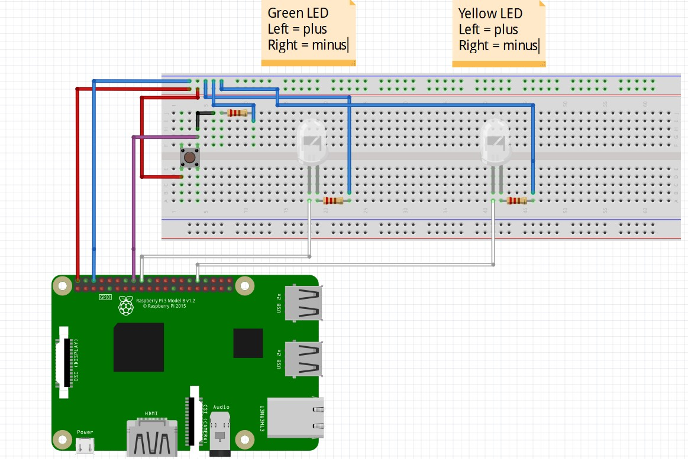
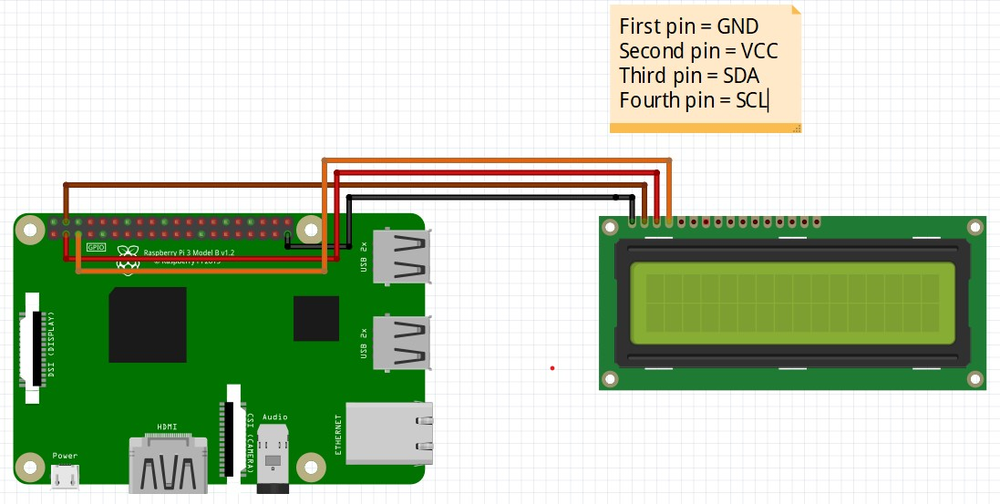
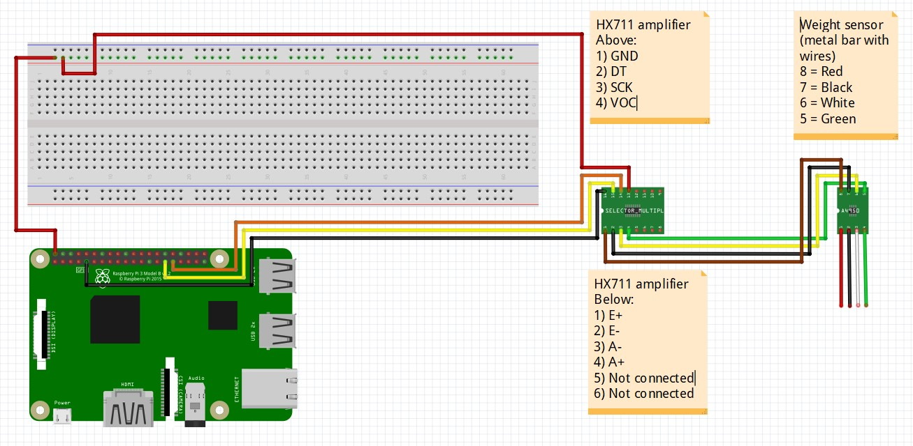

# What is in this file
1) Which libraries have been used
2) Hardware connection file test_pushbutton.py + explanation
3) Hardware connection file LCD_test.py + explanation
4) Hardware connection file LCD_pushbutton.py + explanation
5) Hardware connection file test_weight_sensor.py + explanation
6) Hardware connection file weight_sensor_and_LCD.py + explanation

# 1) Which libraries have been used
Below you find a list with the libraries that we used. 
You can install those packages with the following commands:

```bash
sudo pip3 install [library_name]
```

	- RPi.GPIO (for using GPIO pins of the RPI)
	- hx711 (for weight sensor)
	- RPLCD (for LCD screen)
	- 'git+https://github.com/bytedisciple/HX711.git#egg=HX711&subdirectory=HX711_Python3' (also for weight sensor)

# 2) Hardware conenction file test_pushbutton.py
Everything on the breadboard is connected with the RPI with GPIO pins (input output pins).
Below you find a schema and how everything is connected.
This script makes the Yellow LED glow if the button isn't pushed and makes the green LED glow if the button is pushed.
To execute this script execute the following command:

```python
python3 /home/pi/shippert/transporter/test/test_pushbutton.py
```

To stop the script press ctrl + c and to clear all the lights execute the following command followed by 1 push on the button

```python
python3 /home/pi/shippert/transporter/test/GPIO_Cleanup.py
```


    - The button is connected with pin 16 this is GPIO 23
    - The Green Led is connected with pin 18 this is GPIO 24
    - The Yellow led is connected with pin 32 this is GPIO 12 (PWM0 => this is not important)
    - Pin 6 is the ground pin and is connected with the breadboard (see schema)
    - Pin 2 is the 5 Volt pin and is connected with the breadboard (see schema)



# 3) Hardware conenction file LCD_test.py
The LCD screen is connected with the RPI with GPIO pins (input output pins).
Below you find a schema and how everything is connected.
This script print for 5 seconds "hello world" on the LCD screen
To execute this script execute the following command:

```python
python3 /home/pi/shippert/transporter/test/LCD_test.py
```

The script stops automatically.

    - Pin 6 is the ground pin and is connected with the LCD screen GND pin (Black) (see schema)
    - Pin 4 is the 5 Volt pin and is connected with the LCD screen VCC pin (Brown) (see schema)
    - Pin 3 is GPIO (SDA) and is connected with the LCD screen SDA pin (Red) (see schema)
    - Pin 5 is GPIO (SDL) and is connected with the LCD screen SDL pin (Orange) (see schema)



# 4) Hardware connection file LCD_pushbutton.py + explanation
This is the first script where we combinied 2 scripts into one. 
Everything on the breadboard is connected with the RPI with GPIO pins (input output pins).
The LCD screen is connected with the RPI with GPIO pins (input output pins).
Below you find a schema and how everything is connected.
The script will print some message on the LCD screen depending on the state of the buttons. Is the sensor 1 or 0, is the start button pushed.
To execute this script execute the following command:

```python
python3 /home/pi/shippert/transporter/test/LCD_pushbutton.py
```

The script will stop if you push ctrl + c. It will then power off the lights and clean the LCD screen.

connection from RPI to LCD.

    - Pin 39 is the ground pin and is connected with the LCD screen GND pin (Black) (see schema)
    - Pin 4 is the 5 Volt pin and is connected with the LCD screen VCC pin (Brown) (see schema)
    - Pin 3 is GPIO (SDA) and is connected with the LCD screen SDA pin (Red) (see schema)
    - Pin 5 is GPIO (SDL) and is connected with the LCD screen SDL pin (Orange) (see schema)

connection from RPI to buttons.

    - The button to check if the door is closed is connected with pin 16 this is GPIO 23
    - The button to send the package is connected with pin 36 this is GPIO 16
    - The Green Led is connected with pin 18 this is GPIO 24
    - The Yellow led is connected with pin 32 this is GPIO 12 (PWM0 => this is not important)
    - The white Led is connected with pin 11 this is GPIO 17
    - Pin 6 is the ground pin and is connected with the breadboard (see schema)
    - Pin 2 is the 5 Volt pin and is connected with the breadboard (see schema)

    


# 5) Hardware connection file test_weight_sensor.py + explanation
The weight sensor is made from 2 pieces. We have the sensor itself (metal bar with wires) and we have the HX711 (chip).
The HX711 is purely to amplify the signal of the sensor.
This script isn't finished
To execute this script execute the following command:

```python
python3 /home/pi/shippert/transporter/test/test_weight_sensor.py
```


Connection from RPI and breadbord to HX711

    - Pin 2 is the 5 Volt pin and is connected with the breadboard and via breadboard connected with VOC pin on the HX711 (see schema)
    - pin 31 is GPIO 6 and is connected with the SCK pin on the HX711 (see schema)
    - pin 29 is GPIO 5 and is connected with the DT pin on the HX711 (see schema)
    - pin 9 is the ground and is connected with the GND pin on the HX711 (see schema)

Connection from HX711 to weight sensor

    - E+ is connected with the red wire (see schema)
    - E- is connected with the black wire (see schema)
    - A- is connected with the white wire (see schema)
    - A+ is connected with te green wire (see schema)


